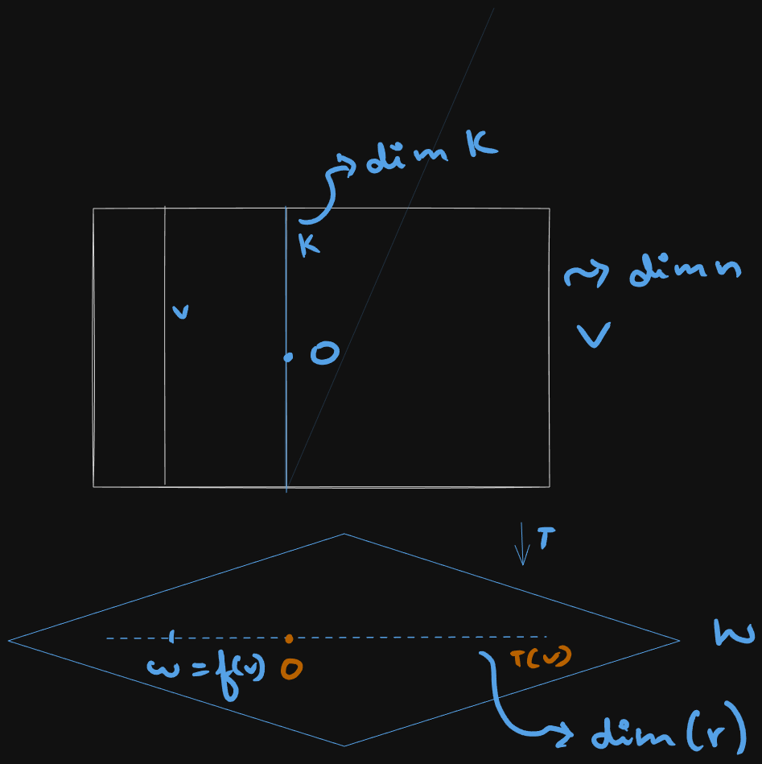
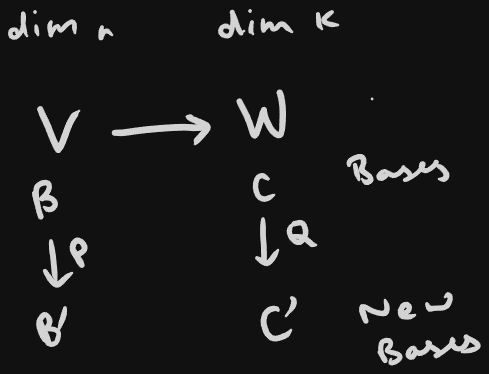

public:: true

- ## Linear map intro
	- $$
	  V \xrightarrow{linear T} W \quad ker(T) = K \\
	  K \mapsto 0 \\
	  \text{fiber over} 0'' \\
	  v + K \mapsto f(v) = w \\
	  \text{fiber over w''} \\
	  \text{(Fiber over }w \notin \text{range of T is empty )}
	  $$
	- ### picture :
	  collapsed:: true
		- {:height 648, :width 356}
-
- ## Theorem 1.1 (rank nullity)
	- $$
	  dim(K) + dim(T(V)) = dim(V) \\
	  nullity(T) + rank(T) = dim(domain)
	  $$
	- If underlying scalars are not from $\R$ but from some other filed $F$ even then __everything__ we have done stays valid (To be revisited)
		- If $|F|$ is finite, say $P$ and if $dimV = n$ then :
		    $$|V|= P^n \quad |K| = P^k \quad |f(v)| = p^r$$
		- then above theorem just becomes
		  $$ P^n = P^r \cdot P^k$$
		  valid by uniformity of fibers
-
- ## Change of basis
	- ### Change of basis :
	  $$ M_{B',C'}(T) = Q^{-1}M_{B,C}(T)P$$
	- __fill in proof for above__
	-
	- Diagram:
	  collapsed:: true
		- {:height 287, :width 277}
	- Meaning of matrix of T wrt B,C is $A''$:
	  $$[T(v)]_C = A [V]_B$$
	- <ins> Notation </ins>
		- $$
		  M_{B,C}(T) = \text{this A} \\
		  [V]_B = \text{coordination vector of V wrt B} \\
		  [V]_{B'} = P^{-1}[V]_B \\
		  $$
-
- ## Determinant
	- sum of $n!$ terms, each of which each is a product of n entries of $A$ chosen such that :
		- each column contributes exactly one factor
		  logseq.order-list-type:: number
		- each row contributes exactly one factor
		  logseq.order-list-type:: number
	- $$det(A)  = \sum (-1)^{l(\sigma)}a_{1\sigma(1)}a_{2\sigma(2)} \dots a_{n\sigma(n)}$$
	  where $\sigma$ is any permutation of column indices 1,2,...,n
	- $l(\sigma) =$ number of inversions in $\sigma$ i.e
		- number of pairs $(i,j)$ such that $\quad i<j \quad$ & $\quad \sigma(i) > \sigma(j)$
		- observe:
			- $l(\sigma) = l(\sigma^{-1})$
			- $\sigma \xrightarrow{switch \; two \; adjacent \; entries, \; say \; in\; slots \; i,\; i+1} \mu$
			  $\Rightarrow \quad l(\mu) = l(\sigma) \pm 1$
			- $\mu = \sigma \circ S_i \quad \text{(where } s_i \text{ is a permutation that switches i and i+1)}$
			- $det(P^{-1}AP) = det(A)$ implies that determinant is an intrinsic property of operator itself and doesn't depend on basis
		-
-
- ## Multilinear Functions
	- Domain $V_1 \times V_2 \times \dots \times V_k$
	- Co-domain W
	- where $V_i$ and $W$ are V.spaces
	- f is called multilinear is fixing all arguments except $i^{th}$ argument gives a linear function in $i^{th}$ argument. this holds for each i
	- multilinear + alternating :
		- if adjacent arguements of f are swapped then f becomes minus of what it was 
		  e.g : $f(V_1,V_2\dots V_k) = -f(V_2,V_1\dots V_k)$
		- consider :
		  $$ f(V_1 + V_2, V_2 + V_2, V_3 \dots)  = 0 \quad \text{(b/c f alternating)}$$
-
- ## Direct Sum
	- ### internal
		- Let $W_{\alpha} \quad \alpha \in I$ be a family of a vector space $V$
		- definitions:
			- span {$W_{\alpha}$} = set of all sums of vectors from $\underset{\alpha \in I}{\cup}W_{\alpha}$
				- we say {$W_{\alpha}$} spans $V$ is $\sum W_{\alpha} = V$
			- {$W_{\alpha}$} is a linear independent family of subspaces means $\sum W_{\alpha} \Rightarrow$ each $W_{\alpha} = 0$
			- If $W_1, \dots W_n$ subspaces of V are linearly independent, then we say V is (internal)direct sum of $W_1, \dots, W_n$ and write
			  $$V= W_1 \oplus \dots \oplus W_n \quad \text{(internal)}$$
	- ### external
		- External direct sum of any vector spaces $W_1, \dots ,W_n$ is the set $W_1\times \dots \times W_n$ made into a vector space with component wise + and scalar multiplication we denote this v.space by :
		  $$W_1\oplus \dots\oplus W_n \quad \text{external}$$
		- Note 
		  $$\RR^n = \RR \oplus $$