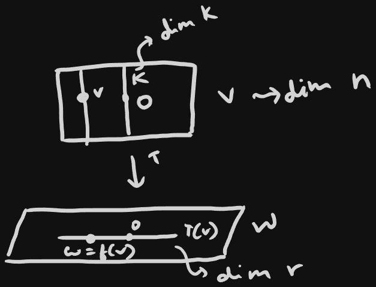

## Linear map intro :
	- $$
	  V \xrightarrow{linear T} W \quad ker(T) = K \\
	  K \mapsto 0 \\
	  \text{fiber over} 0'' \\
	  v + K \mapsto f(v) = w \\
	  \text{fiber over w''} \\
	  \text{(Fiber over }w \notin \text{range of T is empty )}
	  $$
	- 
	-
-
- ## Theorem 1.1 (rank nullity):
	- $$
	  dim(K) + dim(T(V)) = dim(V) \\
	  nullity(T) + rank(T) = dim(domain)
	  $$